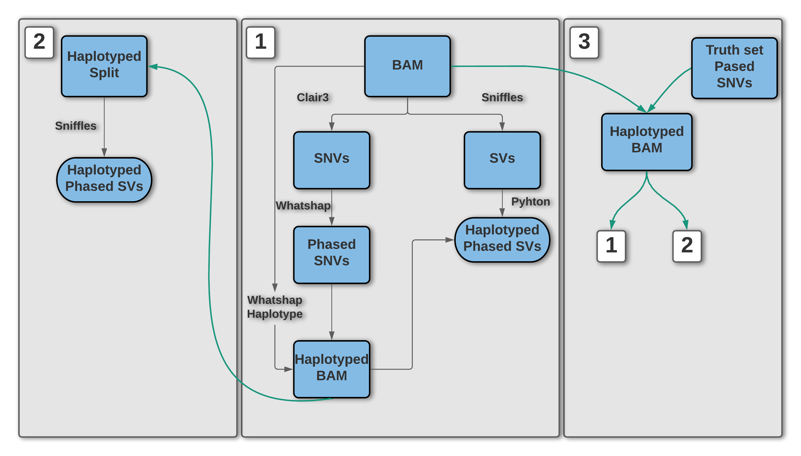

# Sniphles

Sniples: Using Sniffles - but phased
- Start from a BAM with phase per read annotated (e.g. from WhatsHap, LongShot)
- Identify phase blocks and split in monophasic (homozygous), diphasic (heterozygous) and unphased blocks
- Loop over haplotype blogs, split BAM using temporary files and make phased bams => good opportunity for massive parallelization
- run sniffles
- filtering
- concatenating the parts
- merging haplotypes back together using SURVIVOR and force-calling Sniffles

BONUS: 
- can handle cram input (Sniffles CAN'T)
- will output a correctly SORTED VCF (Sniffles doesn't care)

## Please cite our work -- here is the ICMJE Standard Citation:

### ...and a link to the DOI:

### You can make a free DOI with zenodo <link>

## Website (if applicable)

## Intro statement

## What's the problem?

## Why should we solve it?

# What is <this software>?

Overview Diagram

# How to use <this software>

# Software Workflow Diagram



# File structure diagram
#### _Define paths, variable names, etc_

# Installation options:

We provide two options for installing <this software>: Docker or directly from Github.

### Docker

The Docker image contains <this software> as well as a webserver and FTP server in case you want to deploy the FTP server. It does also contain a web server for testing the <this software> main website (but should only be used for debug purposes).

1. `docker pull ncbihackathons/<this software>` command to pull the image from the DockerHub
2. `docker run ncbihackathons/<this software>` Run the docker image from the master shell script
3. Edit the configuration files as below

### Installing <this software> from Github

1. `git clone https://github.com/NCBI-Hackathons/<this software>.git`
2. Edit the configuration files as below
3. `sh server/<this software>.sh` to test
4. Add cron job as required (to execute <this software>.sh script)

### Configuration

```Examples here```

# Testing

We tested four different tools with <this software>. They can be found in [server/tools/](server/tools/) .

# Additional Functionality

### DockerFile

<this software> comes with a Dockerfile which can be used to build the Docker image.

  1. `git clone https://github.com/NCBI-Hackathons/<this software>.git`
  2. `cd server`
  3. `docker build --rm -t <this software>/<this software> .`
  4. `docker run -t -i <this software>/<this software>`

### Website

There is also a Docker image for hosting the main website. This should only be used for debug purposes.

  1. `git clone https://github.com/NCBI-Hackathons/<this software>.git`
  2. `cd Website`
  3. `docker build --rm -t <this software>/website .`
  4. `docker run -t -i <this software>/website`
